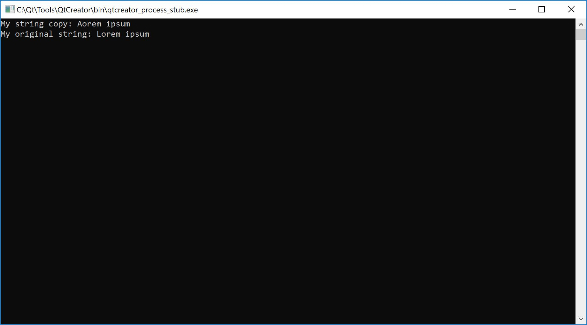
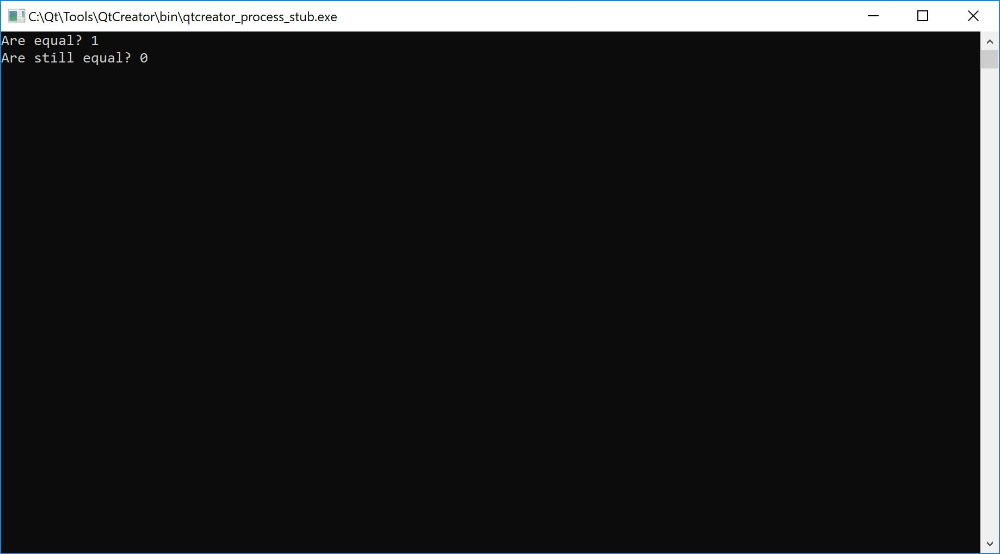
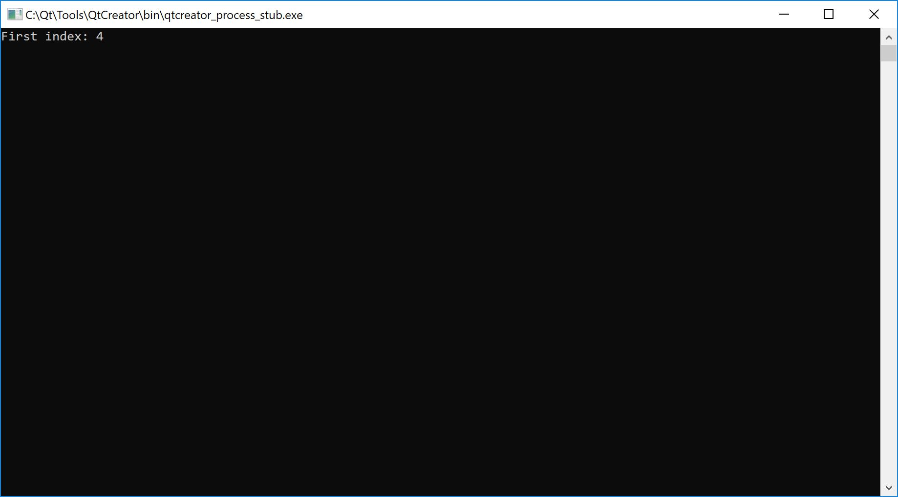
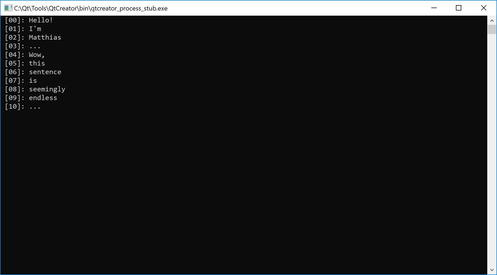
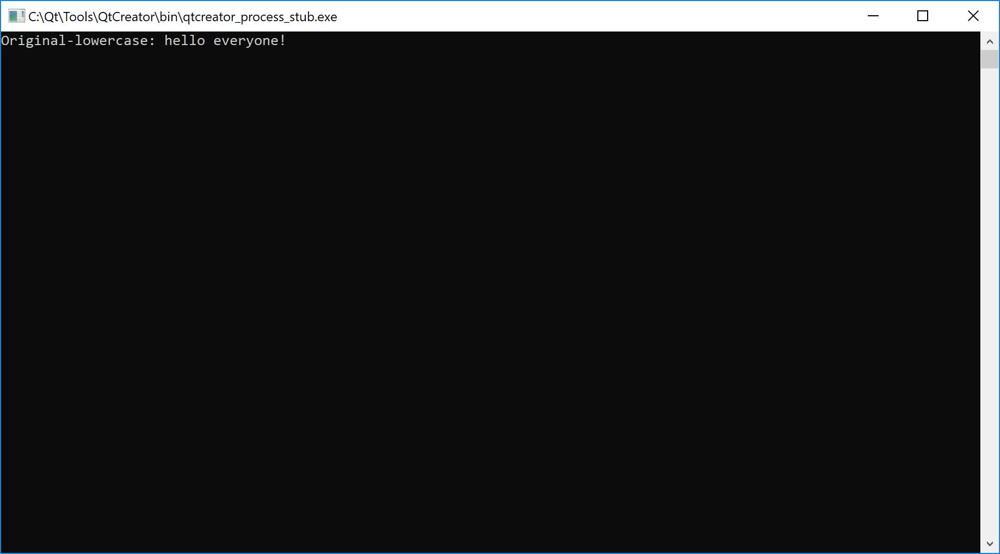
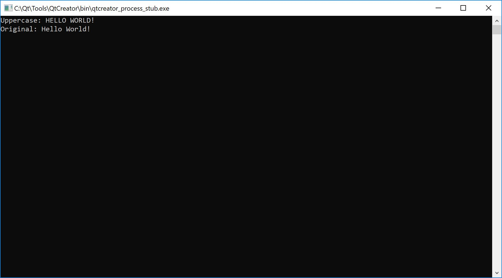

# propaganda.c
_A C-library for string manipulations_

---

Did you ever feel the need to manipulate a _string_ in C? Have you ever wanted to create a substring, replace parts or split a _string_? If you did, now can do all of these things by using _propaganda.c_, the library for manipulating strings.

---

## Table of contents

  * **[Setup](#setup)**
  * **[Usage](#usage)**
    - [strlen()](#getting-the-length-of-a-string)
    - [strcpy()](#copying-a-string)
    - [newstr()](#dynamically-creating-a-string)
    - [strcat()](#concatenating-strings)
    - [strequals()](#comparing-strings)
    - _[Substrings](#creating-substrings)_
      * [substr()](#creating-a-substring-to-the-end)
      * [substring()](#creating-a-substring-from-...-to-...)
    - _[Character indices](#getting-the-index-of-a-character)_
      * [indexOf()](#first-index-of-character)
      * [indexOfFrom()](#first-index-of-character-from-...)
      * [lastIndexOf()](#last-index-of-character)
    - _[Substring indices](#getting-the-index-of-a-substring)_
      * [indexOfString()](#first-index-of-substring)
      * [indexOfStringFrom()](#first-index-of-substring-from-...)
      * [lastIndexOfString()](#last-index-of-substring)
    - [charOccurrence()](#occurrence-of-a-character)
    - [stringOccurrence()](#occurrence-of-a-substring)
    - [split()](#split-at-character)
    - [splits()](#split-at-substring)
    - _[Lowercase](#convert-to-lowercase)_
      * [lowerCase()](#lowercase-copy)
      * [toLowerCase()](#value-to-lowercase)
    - _[Uppercase](#convert-to-uppercase)_
      * [upperCase()](#uppercase-copy)
      * [toUpperCase()](#value-to-uppercase)
    - [replace()](#replace-all-characters)
    - [replaceString()](#replace-all-substrings)
    - [trim()](#trim-whitespace)
    - [itoc()](#integer-to-character)
    - [ctoi()](#character-to-integer)
    - _[To string](#convert-to-string)_
      * [itos()](#integer-to-string)
      * [btos()](#boolean-value-to-string)
      * [ltos()](#long-to-string)
      * [ftos()](#float-to-string)
      * [dtos()](#double-to-string)
    - _[From string](#convert-from-string)_
      * [stoi()](#string-to-integer)
      * [stob()](#string-to-boolean-value)
      * [stol()](#string-to-long)
      * [stof()](#string-to-float)
      * [stod()](#string-to-double)
  * **[Conclusion](#conclusion)**

## Setup

To include the library in your project, you will need to import the `propaganda.h` header file.

```C
#include "propaganda.h"

// ...
```

## Usage

#### Getting the length of a string

In order to determine the length of a given string, you can call the `strlen((char*) string)` function. It will return the length of your string, up to the `'\0'` termination character.

```C
// ...

char* str = "Hello World!";
int lenStr = strlen(str);

printf("Length of my string: %d\n", lenStr);

// ...
```


#### Copying a string

If you want to copy your string by value rather than copying it by reference, you can use the `strcpy((char*) string)` function, which will return the reference to the copy.

```C
// ...

char* str = "Lorem ipsum";
char* copy = strcpy(str);

copy[0] = 'A';

printf("My string copy: %s\n", copy);
printf("My original string: %s\n", str);

// ...
```



#### Dynamically creating a string

To make sure your string works with all of the library functions, and as a good convention, you should create all of your strings by using the `newstr((char*) string)` function.

(Of course you could also use the `strcpy((char*) string)` function, since it does the same thing.)

```C
// ...

char* str = newstr("Hello World!");
printf("My string: %s\n", str);

// ...
```


#### Concatenating strings

In order to attach one string to another one, you should use the `strcat((char*) str1, (char*) str2)` function. It returns a reference to the concatenated string.

```C
// ...

char* str1 = newstr("Hello ");
char* str2 = newstr("World!");

printf("Concatenated: %s\n", strcat(str1, str2));

// ...
```


#### Comparing strings

If you want to compare the value of two strings, use the `strequals((char*) str1, (char*) str2)` function. It will return a value of either `0` or `1`.

```C

// ...

char* str1 = newstr("Hello!");
char* str2 = newstr("Hello!");

printf("Are equal: %d\n", strequals(str1, str2));

str2 = newstr("Hello");
printf("Are still equal: %d\n", strequals(str1, str2));

// ...

```



#### Creating substrings

You can create substrings in two different ways:
  * ##### Creating a substring to the end
    If you want to create a substring starting somewhere and lasting to the end, you can use the `substr((char*) string, (int) start)` function.

    ```C
    // ...

    char* str = newstr("asdf Hello World!");
    str = substr(str, strlen("asdf "));

    printf("New string: %s\n", str);

    // ...
    ```

    

  * ##### Creating a substring from ... to ...
    You can however, also create a substring starting at some index, and ending at another index by using the `substring((char*) string, int start, int end)` function.

    It is to note, that the range of the substring will be **[start;end[**.

    ```C
    // ...

    char* str = newstr("asdf Hello World! asdf");
    str = substring(str, strlen("asdf "), strlen("asdf Hello World!"));

    printf("New string: %s\n", str);

    // ...
    ```

    

#### Getting the index of a character

You might want to get the index of a specific character in a string, in order to do this, you can use the following functions:
  * ##### First index of character
    In order to get the index of the first occurrence of the character, use the `indexOf((char*) str, (char) c)` function.

    ```C
    // ...

    char* str = newstr("Hello World!");
    int index = indexOf(str, 'o');

    printf("First index: %d\n", index);

    // ...
    ```

    

  * ##### First index of character from ...
    Sometimes, you might want to get the first occurrence of a character from a certain index. You can use the `indexOfFrom((char*) str, (char) c)` function to achieve this.

    ```C
    // ...

    char* str = newstr("0123456789 0123456789");
    int fIndex = indexOfFrom(str, '0', 10);

    printf("First index from: %d\n", fIndex);

    // ...
    ```

    

  * ##### Last index of character
    If you need to get the last index of the character, use the `lastIndexOf((char*) str, (char) c)`, which searches the string from the end.

    ```C
    // ...

    char* str = newstr("This sentence has many 'a's ... ");
    int lIndex = lastIndexOf(str, 'a');

    printf("Last index: %d\n", lIndex);

    // ...
    ```

    

**Note:** All `indexOf...()` functions return a value of `-1` if no match was found.

#### Getting the index of a substring

All functions that are available for characters are also available for substrings.
  * ##### First index of substring
    In order to get the index of the first occurrence of the string, use the `indexOfString((char*) str, (char*) sub)` function.

    ```C
    // ...

    char* str = newstr("Hello World!");
    int index = indexOfString(str, "World!");

    printf("First index: %d\n", index);

    // ...
    ```

    

  * ##### First index of substring from ...
    Sometimes, you might want to get the first occurrence of a  string from a certain index. You can use the   `indexOfStringFrom((char*) str, (char*) sub)` function to achieve this.

    ```C
    // ...

    char* str = newstr("0123456789 0123456789");
    int fIndex = indexOfStringFrom(str, "89", 10);

    printf("First index from: %d\n", fIndex);

    // ...
    ```

    

  * ##### Last index of substring
    If you need to get the last index of the substring, use the   `lastIndexOfString((char*) str, (char*) sub)`, which searches the string from the end.

    ```C
    // ...

    char* str = newstr("asdf hello hello asdf");
    int lIndex = lastIndexOfString(str, "hello");

    printf("Last index: %d\n", lIndex);

    // ...
    ```

    

**Note:** All `indexOfString...()` functions return a value of `-1` if no match was found.

#### Occurrence of a character

To get the amount of times a certain character appears in your string, use the `charOccurrence((char*) str, (char) c)` function.

```C
// ...

char* mystr = newstr("asjdflasdjdfkljaskldasdfaaaasdfasdfa");
int amount = charOccurrence(mystr, 'a');

printf("Amount of 'a's: %d\n", amount);

// ...
```


#### Occurrence of a substring

To get the amount of times a specified substring appears in your string, use the `stringOccurrence((char*) str, (char*) sub)` function.

```C
// ...

char* mystr = newstr("asdf qwer asdf qwer asdf qwer asdf qwer");
int amount = stringOccurrence(mystr, "asdf");

printf("Amount of substrings: %d\n", amount);

// ...
```


#### Split at character

To split a string at a specified character, you can use the `split((char*) str, (char) c)` function.

This will return a reference to a char-pointer (the first part). You should combine this with the `charOccurrence(...)` function, to figure out, how many parts there are.

```C
// ...

char* mystr = newstr("Hello! I'm Matthias ... Wow, this sentence is seemingly endless ...");

int amount = charOccurrence(mystr, ' ')+1;
char** parts = split(mystr, ' ');

for (int i = 0; i < amount; i++) {
  printf(" [%02d]: %s\n", i, parts[i]);
}

// ...
```



#### Split at substring

To split a string at a specified substring, you can use the `splits((char*) str, (char*) c)` function.

You should handle it the same way, as the `split(...)` function's return value.

```C
// ...

char* mystr = newstr("Hello!\r\nasdf\r\nqwer\r\n...\r\nWow,\r\nthis\r\nsentence\r\nis\r\nseemingly\r\nendless\r\n...");

int amount = stringOccurrence(mystr, "\r\n")+1;
char** parts = splits(mystr, "\r\n");

for (int i = 0; i < amount; i++) {
  printf(" [%02d]: %s\n", i, parts[i]);
}

// ...
```


#### Convert to lowercase

There are two ways to convert a string to lowercase:
  1. ##### Lowercase copy
    The first, possible way would be to use the `lowerCase((char*) str)` function, which returns a lowercase-copy of the specified string. This is useful, if you don't want to modify the original "string".

    ```C
    // ...

    char* mystr = newstr("Hello World!");
    char* strLow = lowerCase(mystr);

    printf("Lowercase: %s\n", strLow);
    printf("Original: %s\n", mystr);

    // ...
    ```

    

  2. ##### Value to lowercase
    The second option would be, to convert the value of your "string" to lowercase using the `toLowerCase((char*) str)` function.

    ```C
    // ...

    char* str = newstr("Hello everyone!");
    toLowerCase(str);

    printf("Original-lowercase: %s\n", str);

    // ...
    ```

    

    **Note:** When using the `toLowerCase(...)` function, it's necessary, that your string was created dynamically.

#### Convert to uppercase

There are also two ways to convert a string to uppercase:
  1. ##### Uppercase copy
    Similiar to the `lowerCase(...)` function, you can use the `upperCase((char*) str)`, which also returns a copy, but in this case the copy is in upper-case.

    ```C
    // ...

    char* str = newstr("Hello World!");
    char* upp = upperCase(str);

    printf("Uppercase: %s\n", upp);
    printf("Original: %s\n", str);

    // ...
    ```

    

  2. ##### Value to uppercase
    The second option, once again, converts the value of the "string" to uppercase. Use the `toUpperCase((char*) str)` function for this.

    ```C
    // ...

    char* mystr = newstr("Lorem Ipsum");
    toUpperCase(mystr);

    printf("Original-uppercase: %s\n", mystr);

    // ...
    ```

    

    **Note:** When using the `toUpperCase(...)` function, it's necessary, that your string was created dynamically.

#### Replace all characters

You can use the `replace((char*) str, (char) c, (char) r)` function to replace all occurrences of the given character `c` with the specified character `r`.

```C
// ...

char* mystr = newstr("Hello World!");
replace(mystr, 'o', 'a');

printf("String: %s\n", mystr);

// ...
```


#### Replace all substrings

You can use the `replaceString((char*) str, (char*) s, (char*) r)` function to replace all occurrences of the given substring `s` with the specified substring `r`.

```C
// ...

char* mystr = newstr("Hello World!");
mystr = replaceString(mystr, "World", "Humans");

printf("String: %s\n", mystr);

// ...
```


#### Trim whitespace

Use the `trim((char*) str)` function to trim all whitespace from the beginning and end of a string.

```C
// ...

char* msg = newstr("      \n\rHello World!\n     ");
char* trimmed = trim(msg);

printf("Trimmed: %s\n", trimmed);

// ...
```


**-- to be continued --**

## Conclusion

For any questions/suggestions, you can message me on my [twitter](https://twitter.com/Matthia23184857).

---

... Matthias M.
